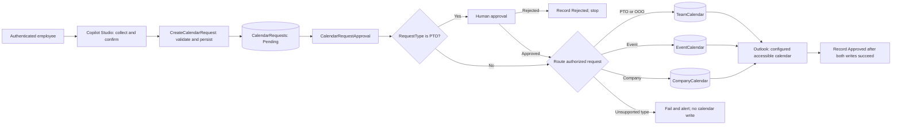

# Calendar Request Approval Agent - Architecture

**Status:** Draft. The diagram describes the reference flow, not a deployed system.

## Logical Architecture

Authentication, input validation, and request-type authorization happen before
the workflow accepts a request. No calendar-writing tool is exposed directly
to the language model.

## Component Responsibilities

| Component | Responsibility | Trust boundary |
|---|---|---|
| Copilot Studio | Collect and confirm bounded inputs; call the submission tool | Conversation is not evidence of identity or authorization |
| Submission agent flow | Validate dates, type, caller, and policy; persist request; return ID | A model-supplied requestor email is not a trusted identity |
| `CalendarRequests` | Canonical request data and status | Protect request details and workflow-owned values from arbitrary edits |
| Approval flow | Apply deterministic policy; capture decision; route publication | Approver comes from approved configuration or validated directory lookup |
| Destination lists | Shared calendar projections with source request ID | Their audience can be broader than the request list's audience |
| Outlook connection | Create an event in an explicitly accessible calendar | Connection identity and mailbox delegation determine access |
| Operations controls | Correlation, failure alerts, reconciliation, retention | Keep operational evidence in an access-controlled location |

## Baseline Request Contract

Use these SharePoint column names consistently with the referenced source.
Display-name changes do not automatically change SharePoint internal names.

| Field | SharePoint type | Rule |
|---|---|---|
| `Title` | Single line of text | Generated request summary |
| `RequestType` | Choice | Exactly `PTO`, `OOO`, `Event`, or `Company` |
| `Subject` | Single line of text | Confirmed, publication-safe title |
| `StartTime`, `EndTime` | Date and time | Normalized UTC instants; end must be after start |
| `Requestor` | Person | Resolved from authenticated context; not chosen by the model |
| `Notes` | Multiple lines of text | Optional; private to the request workflow unless separately approved |
| `Status` | Choice | `Pending`, `Approved`, `Rejected`; default `Pending` |
| `ApproverNote` | Multiple lines of text | Workflow-written decision context |

The submission tool takes `RequestType`, `Subject`, `StartTime`, `EndTime`, and
optional `Notes`. The backend binds `Requestor` to the verified caller. Return
`RequestId` and `Status`; return an explicit error if persistence fails.

Do not add the later, incompatible `EventType`/`ApprovalRequired` contract to
this schema without a separately designed migration.

## Destination Mapping

All lists receive `Title = Subject`, `StartTime`, `EndTime`, and numeric
`SourceId = CalendarRequests.ID`.

| List | Additional fields |
|---|---|
| `TeamCalendar` | `EntryType` choice (`PTO`, `OOO`); `Person` person field |
| `EventCalendar` | `Owner` person field; optional `Location` text and `Notes` multiline |
| `CompanyCalendar` | `Owner` person field; `Audience` choice (`All`, `Org`, `Region`); optional `Notes` multiline |

Create calendar views over the start and end fields. These are SharePoint list
views, not Exchange calendars. If optional fields are not collected and
confirmed, leave them empty; do not infer invitees or locations from private notes.

## Identity and Publication

Use authenticated channels and a supported mechanism to propagate caller
identity to the submission boundary. A service-owned SharePoint connection can
make every item's `Created By` the service owner; it cannot establish who spoke
to the agent. If the chosen agent-flow integration cannot provide a verifiable
caller, implement an authenticated backend before expanding beyond a controlled lab.

An Outlook `Create event (V4)` action writes as its configured connection.
Choose and document the mailbox/calendar, delegation, and consent required.
An optional invitation must show the user its recipients and exact content
before submission; invitations can notify other people immediately.

SharePoint list permissions are not field-level security. Do not grant broad
request-list edit access and then rely on hiding `Status` in a form. Limit writes
to controlled tools, and authorize any status-read operation by request ownership.

## State and Recovery

The lab's `Status` has only three values. `Approved` is written after the
SharePoint projection and Outlook operation succeed; `Rejected` is terminal
without either write. A failure can leave a request `Pending` even after an
approver accepted it, and can leave one calendar updated without the other.

**Required production extension, not supplied here:** add a protected processing
record keyed by a unique request key. Store the approval decision separately from
publication state, destination item ID, Outlook event ID, attempt/correlation ID,
and last error. Serialize or atomically claim work for that key.

On retry, reconcile existing results and resume only the missing operation.
If an Outlook create timed out with an unknown outcome, investigate the target
calendar before retrying. A `SourceId` field alone is not an atomic duplicate
prevention mechanism, and the two services do not share a transaction.

## Design Decisions

| Decision | Reason |
|---|---|
| Separate short submission from long-running approval | An agent tool must return promptly rather than wait for a human |
| Confirm time zone and absolute dates | Relative dates and daylight-saving boundaries are ambiguous |
| Explicit type-to-list mapping | The model cannot select arbitrary calendars or destinations |
| Keep private notes in the request store | Shared calendars and invitations may have wider audiences |
| Keep business authorization outside prompts | Prompt instructions are not an access-control mechanism |

## Navigation

[Overview](./1.Overview.md) | [Runbook](./3.Runbook.md) |
[Sample prompts](./4.Sample-prompts.md)
