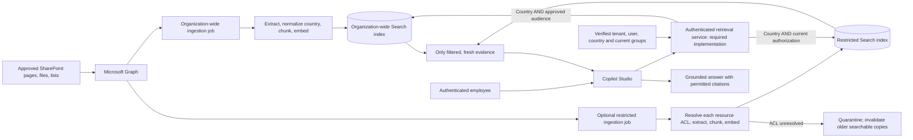

# Country-Aware HR Knowledge Agent - Architecture

**Status:** Draft target architecture. Components and controls below must be
implemented and demonstrated; this folder does not provision them.

## Logical Architecture



The quarantine/invalidation path is a **required design control**, not a claim
that every ingestion implementation removes stale copies correctly.

## Components and Identities

| Component | Purpose | Identity/access |
|---|---|---|
| SharePoint / Graph | Read explicitly selected source content and permission evidence | Ingestion identity with reviewed Graph application permissions |
| Container Apps jobs or equivalent | Isolated ingestion execution for each lane | Managed identities preferred; separate configuration and source scope |
| Azure OpenAI embedding deployment | Produce vectors for chunks and queries | Appropriate Entra-based access, normally Cognitive Services OpenAI User |
| Azure AI Search | Separate indexes with text, vectors, country and ACL metadata | Deployment, ingestion-write, and runtime-read roles separated |
| Container registry / Key Vault, if needed | Store approved images and unavoidable secrets/certificates | Scoped pull and secret access; never embed secrets in images |
| Retrieval API on an approved host | Authenticate caller, derive filters, query allowed indexes | Read-only Search access; no direct Search credentials delivered to users |
| Copilot Studio | Ask clarifying questions and compose answers from permitted evidence | Authenticated channel and authenticated tool integration |
| Monitoring | Detect failed sources, stale ACLs, extraction gaps, and cost/latency issues | Access-controlled logs without raw HR text or broad identity dumps |

`Sites.Selected` plus a separate grant on each selected site can restrict
application access. Consent alone does not grant site access, and a site grant
does not prove that every chosen content or permission API is supported by that
permission set. Test actual endpoints; do not silently escalate to tenant-wide
access when discovery fails.

Search Index Data Contributor permits ingestion data writes; Search Service
Contributor can manage index definitions. Keep definition-management privileges
with deployment where possible. Runtime normally needs Search Index Data Reader,
not either writer role. Document applicable role scope and residual access:
separate indexes on the same service are not automatically separate RBAC boundaries.

## Index Contract

The following describes a generic adapter contract, not a supplied index-creation
script. Use the selected embedding model's actual dimensions consistently for
ingestion, index schema, and query embeddings.

| Field | Type | Purpose |
|---|---|---|
| `Id` | String key | Stable, collision-resistant chunk identifier |
| `SiteId`, `PageId` | Filterable strings | Source identity; include resource identity for linked files |
| `Title`, `Chunk` | Searchable strings | Source title and extracted body text |
| `Url`, `ParentPageUrl` | Strings | Original citation and optional link provenance |
| `PageType` | Filterable string | Approved content category |
| `Country` | Filterable string collection | Canonical applicability tags |
| `LastModified` | Date/time | Source modification time, not evidence of permission freshness |
| `Embedding` | Vector | Model-compatible embedding with matching vector profile |
| `IsSecurityTrimmed` | Filterable boolean | Indicates resolved security metadata; not an access decision |
| `IsPublic` | Filterable boolean | True only for content explicitly approved for the organization-wide lane |
| `AllowedUserIds`, `AllowedGroupIds` | Filterable string collections | Resolved principals for restricted resources |

Default unclassified content to **not public**. A generic adapter must not rely
on permissive object defaults. Track source/config version, crawl completeness,
content expiry, and ACL verification/expiry in a manifest or additional indexed
fields. These freshness controls are required extensions, not implicit properties
of `LastModified`.

## Country Contract

Source country labels may be free-form; the reference ingestion approach does
not define universal country/global semantics. This draft introduces an explicit
normalization contract:

| Input | Required handling |
|---|---|
| Known country label | Map through an HR-owned dictionary to a canonical country code |
| Explicitly approved global policy | Store `GLOBAL` |
| Missing, unknown, or conflicting country tags | Quarantine until resolved; never assume global |
| Caller country unavailable | Ask for clarification through the approved context-resolution process; do not query all countries |

`GLOBAL` is a proposed convention in this design, not a built-in SharePoint or
Azure AI Search feature. Work country must come from an approved identity/HR
mapping, not an arbitrary user message or an unrelated directory location field.

For ordinary self-service, eligibility is the caller's mapped country plus
explicit global content. Cross-country comparison requires a separately
authorized mode; it is not enabled by changing text in the prompt.

## Query-Time Authorization

The retrieval API must validate token issuer, audience, tenant, expiry, and caller
identity. It derives the country and current permitted principal set server-side,
handles group-claim overage/pagination and relevant transitive membership, and
fails closed when identity or membership cannot be established.

For the organization-wide lane, require an admitted employee, approved source,
fresh content, matching country, and `IsPublic = true`.

For the restricted lane, require fresh/valid ACL evidence,
`IsSecurityTrimmed = true`, `IsPublic = false`, matching country, and a matching
user or group principal. This deliberately does not allow a permissive
`IsPublic = true` record to bypass the restricted lane's gate.

Illustrative restricted-index filter for a synthetic US employee:

```text
(Country/any(c: c eq 'US' or c eq 'GLOBAL'))
and IsSecurityTrimmed eq true
and IsPublic eq false
and (
  AllowedUserIds/any(u: u eq '<verified-user-object-id>')
  or AllowedGroupIds/any(g: search.in(g, '<verified-group-id-1>,<verified-group-id-2>', ','))
)
```

This is filter-shape documentation, not executable authentication code. Build
filters using validated values and safe OData escaping; never accept raw filters,
index names, user IDs, or groups from the model. Handle an empty group set
explicitly while retaining any authorized direct-user match. Add the implemented
freshness gates before query execution.

Apply controls on every lexical/vector/hybrid search path, suggestions, counts,
citations, and caches. Prefer vector prefiltering when available for the chosen
API. A direct knowledge connection is unsuitable for restricted content unless
its exact caller-aware enforcement is demonstrated. Do not retrieve everything
and ask the model to hide unauthorized results.

## Linked Resources, Refresh, and Failure

A readable parent page does not authorize a linked file. Resolve each child's
effective permission model independently; do not inherit the parent's ACL merely
because its URL appears there. Country inheritance is a separate, explicitly
approved metadata decision.

Supported sharing links, SharePoint groups, Entra groups, unique permissions,
and inheritance must be tested separately. Unsupported or unresolved permission
models are denied, not reclassified as organization-wide content.

The reference ingestion approach skips deletion reconciliation after a detected
source failure or a limited run. That protects against accidental bulk deletion,
but is **not** proof that stale indexed content is safe. An implementation must
track completeness below the source level, invalidate formerly indexed content
whose ACL is now unknown, and enforce a bounded freshness policy.

Caller group changes and source ACL changes are distinct. Fresh group resolution
can deny a removed group member without reingesting unchanged document group IDs.
Changing a document's allowed principals requires ACL refresh. Token/group
caches, search-result caches, and old conversation content also need an explicit
revocation policy; do not claim instantaneous revocation.

## Navigation

[Overview](./1.Overview.md) | [Runbook](./3.Runbook.md) |
[Sample prompts](./4.Sample-prompts.md)
